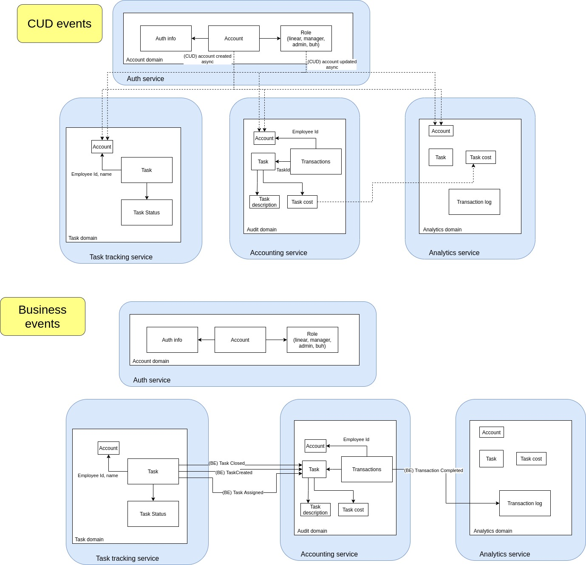

# What is that

Educational project of task tracker. Implemented as a group of services.

Scheme of domains and services, along with events, produced and consumed by services:

# How to run

* Execute `docker-compose up`, wait for Kafka brokers to start. If failed to start, shut down docker, wait for 20 seconds and try again. I don't know how to configure Kafka properly
* `cd popug_jira && ./manage.py runserver`
